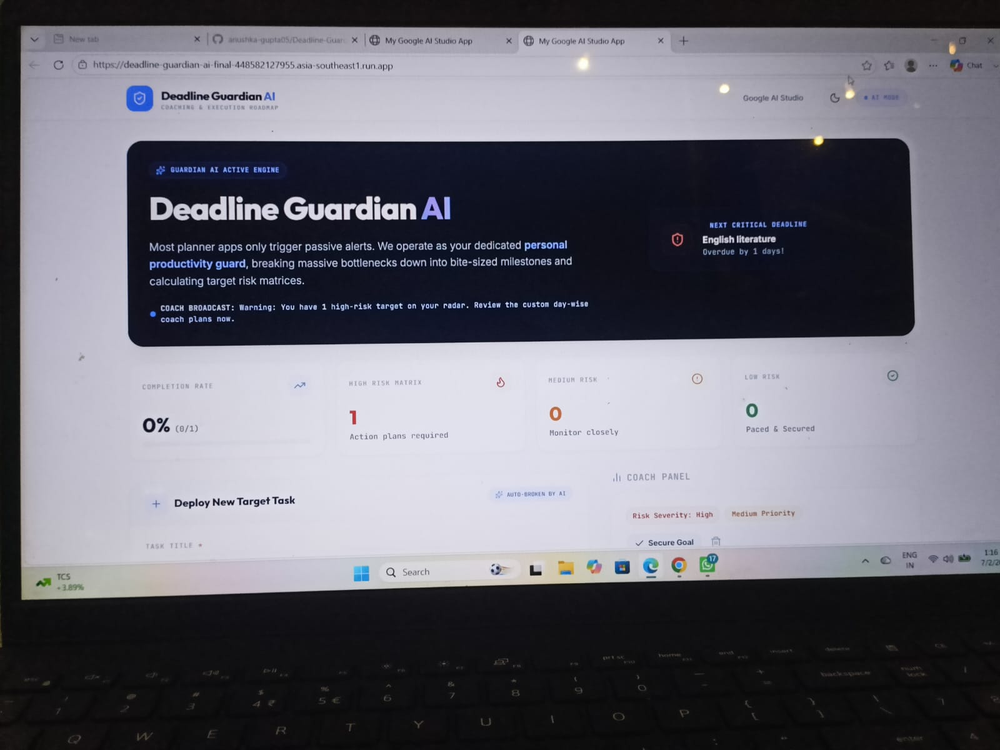
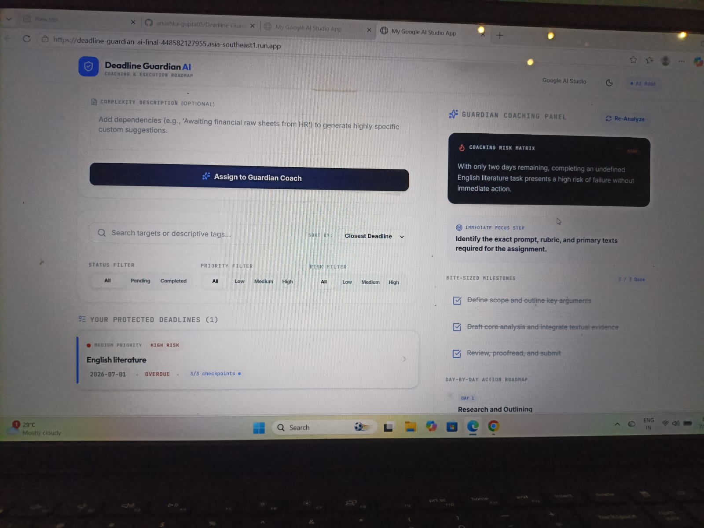
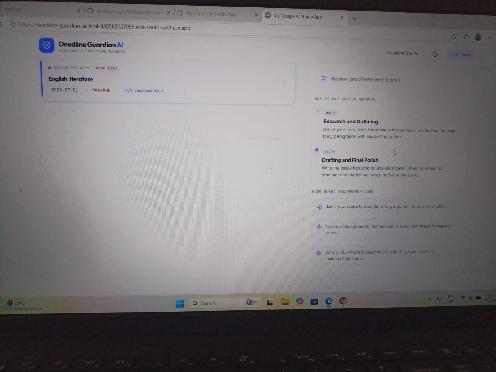
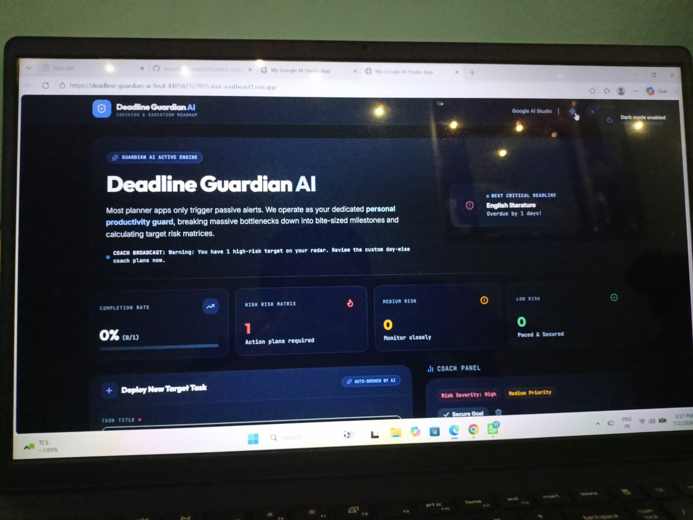
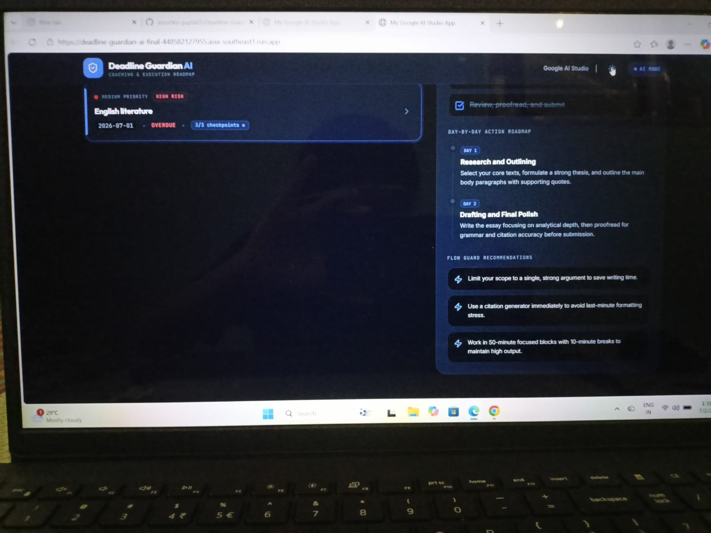

<div align="center">

</div>

# Deadline Guardian AI

An AI-powered productivity application that helps users plan, prioritize, and complete their tasks before deadlines are missed.

## Overview

The idea behind **Deadline Guardian AI** is simple: reminders alone aren't enough. Instead of just notifying users about upcoming deadlines, the application provides intelligent planning, prioritization, and personalized guidance to help users stay productive and complete their work on time.

## Features

- 🤖 AI-powered task prioritization
- 🗺️ Personalized coaching and execution roadmap
- 📊 Smart progress tracking and task management
- 🌙 Dark & Light mode support
- 📱 Mobile-friendly responsive design
- ⚡ Fast and intuitive user experience

## 🛠️ Tech Stack

- React 19
- TypeScript
- Vite
- Tailwind CSS
- Google Gemini AI
- Express.js
- Motion
- Lucide React

## 🚀 Getting Started

### Prerequisites

- Node.js
- npm

### Installation

```bash
git clone <your-repository-url>
cd <repository-name>
npm install
```

Create a `.env.local` file and add your Gemini API key:

```env
GEMINI_API_KEY=your_api_key
```

Run the application:

```bash
npm run dev
```

## 🌐 Live Demo

🔗 (https://deadline-guardian-ai-final-448582127955.asia-southeast1.run.app)

## 📸 Screenshots

### ☀️ Light Mode







### 🌙 Dark Mode






## 👩‍💻 Author

**Anushka Kumari Gupta**

---

Built with ❤️ using React and Google Gemini AI.
